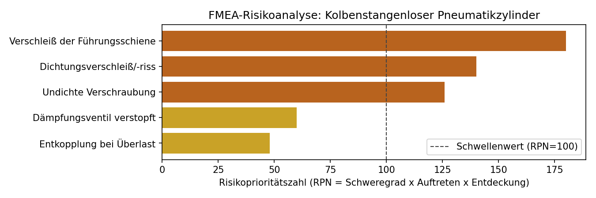

# fmea-risk-tool

A structured tool for conducting an FMEA (Failure Mode and Effects
Analysis) — the standard quality/risk-assessment method referenced in
ISO 13485, MDR, and virtually every medical device quality process —
applied here to a real component from this portfolio's CAD work (a
rodless pneumatic cylinder).



*Every possible failure mode of the component is rated 1–10 on three
axes (severity, occurrence, detection), automatically combined into a
Risk Priority Number (RPN), and ranked so the most urgent risks are
addressed first.*

## Why this exists

FMEA appears on almost every quality-focused resume and job posting in
medical device engineering, but it's rarely something a student
portfolio actually *demonstrates* — usually it's just a listed skill.
This project closes that gap: a working tool that performs a real FMEA
end to end, from rating a failure mode to a ranked, actionable report.

## What it does

- **`fmea_tool.model`** — the core data model: a `FailureMode` (component,
  function, failure mode, effect, and the three 1–10 ratings) with a
  computed `rpn` property and a `risk_level` band (LOW/MEDIUM/HIGH/CRITICAL).
  An `FMEAAnalysis` holds a set of failure modes and can rank them or
  filter to those above a chosen risk threshold.
- **`fmea_tool.report`** — turns an analysis into a sorted table (CSV)
  and a horizontal bar chart, colored by risk band, with the action
  threshold marked.
- **`scripts/run_fmea_demo.py`** — a complete worked example: an FMEA
  of a rodless pneumatic cylinder (five real, plausible failure modes:
  seal wear, guide rail wear, magnetic decoupling under overload,
  clogged end-cushioning valve, a loose fitting), demonstrating the
  tool on a genuine mechanical component rather than an abstract example.

## Getting started

```bash
pip install -e ".[dev]"
pytest -v                        # 9 tests
python scripts/run_fmea_demo.py  # regenerates the report and chart
```

## Roadmap

- Add a second real FMEA example from a software/embedded context
  (tying together this project and the other testing-focused ones in
  this portfolio)
- Support importing failure modes from a spreadsheet (CSV/Excel) for
  faster real-world use
- Add a simple recommended-action tracker (open/closed status per item)
